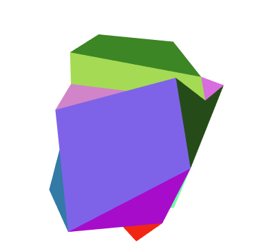

# InteractiveGraphics - homework1 - SalvatoreCognetta

## Point 1
As asked in the first point of the homework, I've replaced the cube with a 29-vertices object with irregular geometry.   

  



The object is in a fixed position but can rotate on his own x,y,z axis. This is made defining a rotation matrix in the render function of the program, passed then to the vertex shader as `uRotationMatrix` which is used to rotate the object as `uRotationMatrix * aPosition`, where aPosition is the vec4f position of each vertex. The direction of the rotation can be modified with an associated button.  
The object is created with the `colorCube` function, in which there is a call to the `quad` function for each quad-face of the object. A quad is defined as 2 triangles that shares 2 verteces (for a total of 6), I've inserted also triangular faces: to do so instead of creating a similar triagle function, I've called the quad function creating a "normal" triangle and a degenerate one (c = d or z = w).  
In the `quad` function I've populated 4 arrays for each vertex: 
 - the pointsArray, which is the vertex position itself;
 - the colorsArray, which is the the rgba vector associated with the face of the quad;
 - the normalsArray, contains the normal vector to the plane/quad-face. We know that q plane is determined by three points p0, p2, p3, so the normal is calculated as $(p_2 - p_0) \times (p_1 - p_0)$ where $\times$ is the cross product between the two resulting vectors. We use the right hand rule to determine the outward vector on the face;
 - the texCoordsArray, mapping parametric texture coordinates to the vertices, going from texture space to the object space.
<br>
<br>

## Point 2
I've added a viewer position using the lookAt function of `MV.js` that creates a model-view matrix for the positioning of the camera. In particular the lookAt function takes 3 parameters: 
1. **eye**: the position (a vec3f) of the camera;
2. **at**: where we are pointing the camera (or in which direction we are looking);
3. **up**: the orientation of the camera.

I've added sliders for the x,y,z position of the eye, therefore when one of these slider is moved the vec3f of the eye is modified and the model-view matrix passed to the vertex shader is changed. In fact this model-view matrix is multiplied to the rotation-matrix*position in the vertex shader, and this moves the camera/eye position (or better each vertex position passed to the vertex shader).

Moreover I've added a perspective projection, using the perspective function which takes:
1. **fovy**: the field of view, which simulate the y aperture angle of the eye;
2. **aspect**: the aspect ratio of the frame we re looking at;
3. **near**: the nearest distance from the camera we can see;
4. **far**: the further distance from the camera we can see.

The perspective resultant matrix distorts the object simulating the projection. In particular we multiply this 4x4 matrix (because we use homogeneous coordinates) by the results of previous transformation of the vertex position (`uModelViewMatrix * uRotationMatrix * aPosition`);  
I've added sliders to modify all the 4 parameters of the perspective function, every time there is a change on the slider the perspective matrix changes and the new matrix is passed to the vertex shader.

## Point 3
I've added 2 different lights, a directional light and a spotlight. To implement lights in webgl we need normals to the plane, material properties and light properties itself. 

For the directional light I've defined the position of the light,which can be moved with sliders, and beacuse each light source has separate diffuse, specular, and ambient terms I've defined also these terms with the exception of the specular component not used in the implemented cartoon shading model.   

The spotlight is a restrict light from ideal point source, it's made by restricting the shape of the light to a cone. It is described with a position, a direction and a cutoff. In particular if the angle between the vector of the spotlight direction (defined as a vec4f), which describes the axis of the cone-light, and the vector to the light from the vertex is greater than the cutoff, then the light can be added to the shading equation, otherwise the spotlight doesn't modify the equation.  
I've added also a button that toggle the spotlight and a slider that modify the cutoff value.

## Point 4
Light that strikes an object is partially absorbed and partially scattered. The amount reflected determines the color
and brightness of the object. For this purpose I've added  two vectors `materialAmbient` and `materialDiffuse` (we don't have the specular component in our shading model) which describes the material characteristics of the object and is used in the rendering equation of the cartoon shading model.

## Point 5
I've implemented the simplified per-fragment version of the cartoon shading model illustrated by Lake A., Marshall C., Harris M. & Blackstein M.  
First of all we notice that in per-vertex shading the calculation are done for each vertex, the Gouraud shading, (the lighting is only calculated at the vertices) and, if passed to the fragment shader, the vertex shade are interpolated through the object. In this case the tessellation of the surface affects the quality of the shading. While calculating the lighting on the fragment shader the normals are interpolated, this process is called Phong shading, and the lighting results smoothed. 
The model tells that:
```javascript
//pseudocode
if Max{L*n,0} >= 0.5
    Ci = ag*am + al*am + dl*dm
    assign Ci to the fragment
else
    Cs = ag*am + al*am
    assign Cs to the fragment
```
Because we don't have a global light we can omit the `ag*am` term.  
I've added also a button to switch from the Cartoon Shading to a basic Phong shading (without the specular component).

## Point 6
To apply texture, first of all I've associated an image to texture and enabled texturing inside the `configureTexture` function. I've used mipmapped textures, which allows images of progressively lower resolution. Mipmap textures are used in 3D scenes to decrease the time required to render a scene.  
Inside the `quad` function, instead, I've assigned parametric texture coordinates to each vertex as a 2-dimensional vertex attribute. 
These texture coordinates are used in the fragment shader, in fact textures are applied during fragments shading by a sampler, that  returns a texture color from a texture object.   
I've added a button that applies or remove the texture to the object.
